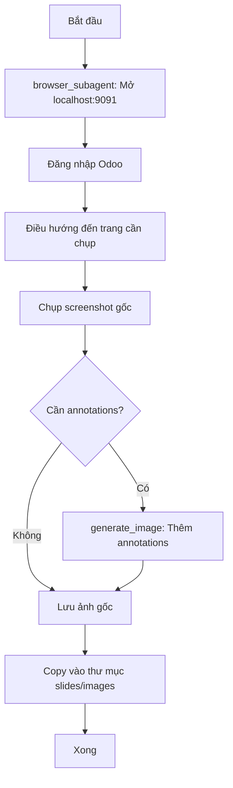

# Workflow: Tạo Tài Liệu Dạng Slides

## Mục đích
Chuyển đổi nội dung hướng dẫn thành định dạng slides với:
- Hình ảnh minh họa trực quan cho mỗi bước
- Script thuyết trình chi tiết
- Format phù hợp cho đào tạo/thuyết trình

---

## Thông tin đầu vào cần thu thập

1. **Chủ đề slides**: Hướng dẫn về tính năng/quy trình nào?
2. **Nguồn nội dung**: 
   - Tài liệu có sẵn (file markdown)
   - Hoặc tạo mới từ hệ thống
3. **Số slides mong muốn**: Ước lượng (5-10, 10-20, 20+)
4. **Đối tượng học viên**: Nhân viên mới / Nhân viên có kinh nghiệm / Quản lý
5. **Mục đích**: Training / Thuyết trình / Tài liệu tham khảo

---

## Thông tin đăng nhập Odoo (để chụp screenshots)

| Thông tin | Giá trị |
|-----------|---------|
| **URL** | `http://localhost:9091/` |
| **Email** | `nguyentrucanhtuan@gmail.com` |
| **Password** | `anhtuan2609` |

---

## Bước 1: Phân tích nội dung nguồn

### Nếu có tài liệu sẵn:
// turbo
```bash
# Đọc file tài liệu hiện có
cat /Users/tuan/coffeetree_odoo19_dev/custom_addons/docs/<ten_file>.md
```

### Nếu tạo mới:
1. Sử dụng workflow `/trcf_write_documentation` để tạo nội dung trước
2. Hoặc nghiên cứu module/tính năng trực tiếp

### Output bước này:
- Danh sách các bước chính cần hướng dẫn
- Các khái niệm/thuật ngữ quan trọng
- Các thao tác cần minh họa bằng hình ảnh

---

## Bước 2: Lập dàn ý Slides

Mỗi slide nên có:
- **1 ý chính duy nhất** (không quá dài)
- **Hình ảnh minh họa** (screenshot hoặc mockup)
- **Script thuyết trình** (30-60 giây đọc)

### Template dàn ý:

```markdown
## Dàn ý Slides: [Tên chủ đề]

1. **Slide 1 - Giới thiệu**: Mục đích & tổng quan
2. **Slide 2 - Truy cập**: Cách vào tính năng
3. **Slide 3-N - Các bước thực hiện**: Mỗi bước 1 slide
4. **Slide N+1 - Lưu ý quan trọng**: Tips & cảnh báo
5. **Slide cuối - Tổng kết**: Recap & Q&A
```

---

## Bước 3: Tạo hình ảnh minh họa

> ⚠️ **QUAN TRỌNG**: Ưu tiên chụp screenshot thật từ hệ thống thay vì AI mockup để đảm bảo tính chính xác.

### Cách 1: Screenshot từ hệ thống (KHUYẾN NGHỊ - Ưu tiên cao)

#### Bước 3.1: Đăng nhập và điều hướng
1. Dùng `browser_subagent` để:
   - Mở URL: `http://localhost:9091/`
   - Đăng nhập với credentials ở phần đầu workflow
   - Điều hướng đến trang cần chụp

#### Bước 3.2: Chụp screenshot
1. Sử dụng `capture_screenshot` trong browser_subagent
2. Screenshot sẽ được lưu tự động

#### Bước 3.3: Thêm Annotations (biểu tượng hướng dẫn)
Sau khi có screenshot, sử dụng `generate_image` để thêm annotations:

```
Prompt mẫu để thêm annotations:
"Add annotation overlays to this Odoo screenshot. Add a [loại annotation] around [vị trí element]. 
Keep the original screenshot intact, only add the annotation layer on top."
```

**Các loại annotations có thể thêm:**

| Loại | Mô tả | Khi nào dùng |
|------|-------|--------------|
| 🔴 **Vòng tròn đỏ** | Circle highlight | Nhấn mạnh nút bấm, icon |
| ➡️ **Mũi tên đỏ** | Arrow pointing | Chỉ hướng nhìn, thứ tự bước |
| 🔲 **Khung chữ nhật** | Rectangle box | Highlight form field, section |
| 🔢 **Số thứ tự** | Numbered steps | Nhiều bước trong 1 ảnh |
| 💬 **Callout text** | Text annotation | Giải thích ngắn gọn |

**Ví dụ prompt thêm annotations:**
```
"Take this TRCF POS screenshot and add annotations:
1. Draw a red circle around the 'Mới' button in the top-left
2. Add a red arrow pointing from bottom-left to the button
3. Add text label 'Nhấn vào đây' near the arrow
Keep all original UI elements visible and clear."
```

#### Bước 3.4: Lưu ảnh với annotations
- Ảnh gốc (không annotations): `slide_XX_original.png`
- Ảnh có annotations: `slide_XX_<mô_tả>.png`

### Cách 2: Tạo mockup bằng AI (Backup - chỉ dùng khi không thể chụp)
1. Sử dụng `generate_image` để tạo mockup UI
2. Mô tả chi tiết: layout TRCF POS, màu sắc, các elements
3. **Lưu ý**: AI mockup có thể không chính xác với UI thật

### Quy tắc đặt tên ảnh:
```
slide_XX_<mô_tả_ngắn>.png
```
Ví dụ: `slide_01_man_hinh_chinh.png`, `slide_02_nut_them_moi.png`

### Lưu ảnh vào:
```
/Users/tuan/coffeetree_odoo19_dev/custom_addons/docs/slides/<ten_chu_de>/images/
```

### Quy trình chụp screenshot đề xuất:



---

## Bước 4: Viết Script thuyết trình

### Nguyên tắc viết script:
1. **Ngắn gọn**: 30-60 giây đọc/slide
2. **Rõ ràng**: Dùng ngôn ngữ đơn giản
3. **Hành động**: Dùng động từ mạnh ("Nhấn", "Chọn", "Nhập")
4. **Liên kết**: Kết nối với slide trước/sau

### Template script:

```markdown
**Script:**
"[Mở đầu - 1 câu định hướng]
[Nội dung chính - 2-3 câu giải thích]
[Kết - 1 câu chuyển tiếp sang slide tiếp theo]"
```

### Ví dụ script:
```markdown
**Script:**
"Để thêm sản phẩm mới, chúng ta bắt đầu từ màn hình danh sách sản phẩm.
Các bạn hãy chú ý nút 'Mới' màu xanh ở góc trái phía trên.
Đây là nút chúng ta sẽ sử dụng. Hãy nhấn vào đó."
```

---

## Bước 5: Tạo file Slides Markdown

### Tạo file output:
```
/Users/tuan/coffeetree_odoo19_dev/custom_addons/docs/slides/<ten_chu_de>/slides.md
```

### Template Slides:

```markdown
# [Tên Chủ Đề] - Training Slides

---

## Slide 1: Giới thiệu


**Nội dung chính:**
- Điểm 1
- Điểm 2

**Script:**
"Chào mừng các bạn đến với buổi hướng dẫn về [chủ đề].
Hôm nay chúng ta sẽ học cách [mục tiêu chính].
Hãy cùng bắt đầu."

---

## Slide 2: Truy cập tính năng


**Nội dung chính:**
- Đường dẫn: `Menu chính` → `Menu con` → `Tính năng`

**Script:**
"Để truy cập tính năng này, các bạn vào menu [tên menu].
Chọn tiếp [menu con], rồi nhấn vào [tính năng].
Màn hình sẽ hiện ra như hình các bạn đang thấy."

---

## Slide 3: [Bước 1 - Tên bước]


**Nội dung chính:**
- Hành động: [Mô tả hành động]
- Kết quả: [Kết quả mong đợi]

**Script:**
"Bây giờ chúng ta thực hiện bước đầu tiên.
[Giải thích chi tiết hành động]
[Kết quả và chuyển tiếp]"

---

## Slide N: Lưu ý quan trọng


**Nội dung chính:**
> ⚠️ **Lưu ý 1**: Điều cần tránh
> 💡 **Mẹo 1**: Điều nên làm

**Script:**
"Trước khi kết thúc, có một số lưu ý quan trọng.
Thứ nhất, [lưu ý quan trọng].
Thứ hai, một mẹo hay là [tip hữu ích]."

---

## Slide cuối: Tổng kết

**Nội dung chính:**
✅ Đã học:
1. [Điều 1]
2. [Điều 2]
3. [Điều 3]

📌 Bước tiếp theo: [Gợi ý thực hành]

**Script:**
"Vậy là chúng ta đã hoàn thành buổi hướng dẫn.
Các bạn đã biết cách [tóm tắt những gì học được].
Hãy thử thực hành ngay hôm nay. Cảm ơn các bạn đã theo dõi!"

---

*Slides được tạo cho TRCF POS - Training*
```

---

## Bước 6: Review và hoàn thiện

### Checklist:
- [ ] Mỗi slide chỉ có 1 ý chính
- [ ] Tất cả slides đều có hình ảnh minh họa
- [ ] Tất cả slides đều có script thuyết trình
- [ ] Script không quá dài (< 60 giây/slide)
- [ ] Hình ảnh rõ ràng, có đánh dấu vùng quan trọng
- [ ] Thứ tự slides logic, dễ theo dõi
- [ ] Ngôn ngữ nhất quán toàn bộ
- [ ] Đã test đọc script với slides

---

## Tips tạo Slides hiệu quả

### DO ✅
- Mỗi slide = 1 ý chính
- Dùng hình ảnh thực tế từ hệ thống
- Script ngắn gọn, dễ đọc
- Đánh dấu/highlight vùng quan trọng trong ảnh
- Có slides tổng kết và Q&A

### DON'T ❌
- Nhồi nhét quá nhiều nội dung/slide
- Dùng text thay cho hình ảnh
- Script quá dài, đọc mất > 90 giây
- Hình ảnh mờ, không rõ chi tiết
- Bỏ qua slides giới thiệu/tổng kết

---

## Cấu trúc thư mục output

```
/Users/tuan/coffeetree_odoo19_dev/custom_addons/docs/slides/
└── <ten_chu_de>/
    ├── slides.md           # File slides chính
    └── images/             # Thư mục chứa hình ảnh
        ├── slide_01_xxx.png
        ├── slide_02_xxx.png
        └── ...
```

---

## Ví dụ sử dụng

Người dùng yêu cầu:
> "Tạo slides hướng dẫn thêm sản phẩm vào POS"

Thực hiện:
1. Đọc tài liệu `/docs/huong_dan_them_san_pham.md`
2. Phân tích thành 8-10 slides
3. Chụp screenshots từng bước
4. Viết script cho mỗi slide
5. Tạo file `/docs/slides/them_san_pham/slides.md`

---

*Workflow version 1.0 - TRCF*
