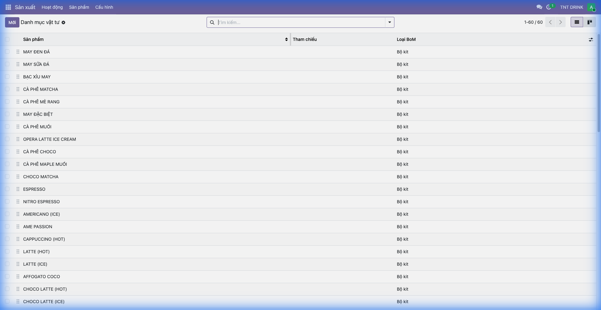
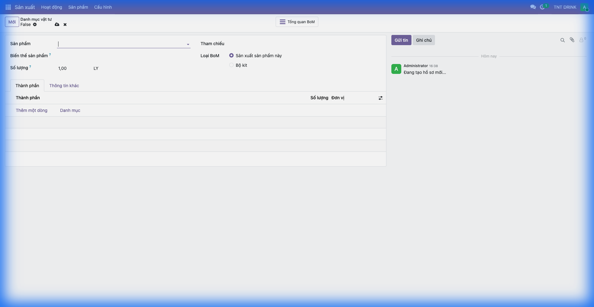
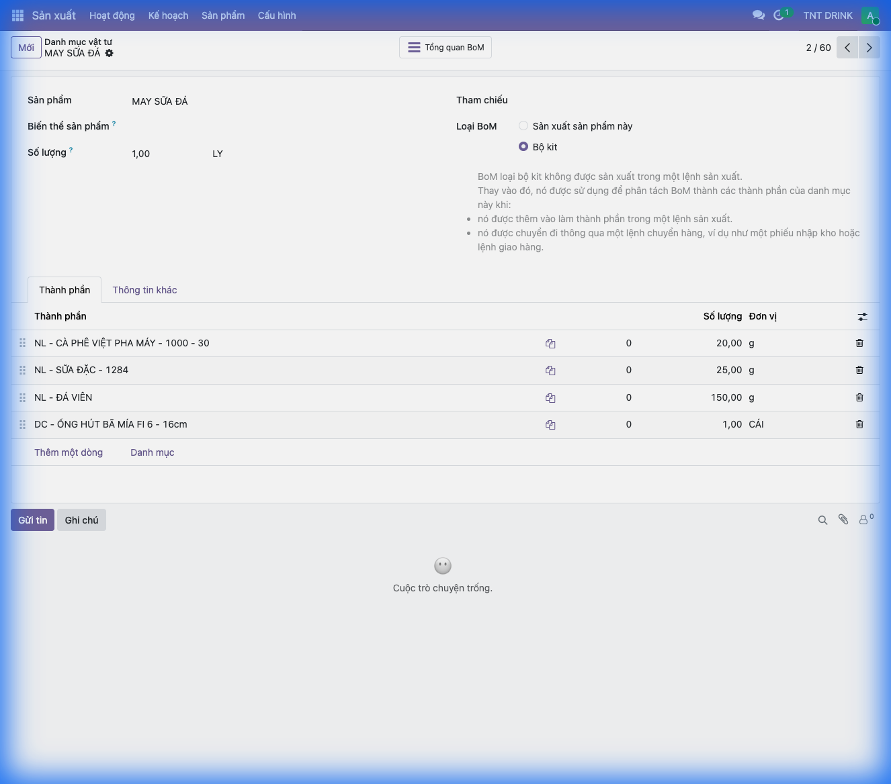

# Hướng Dẫn Cấu Hình Công Thức (BoM) Trong Odoo 19

## Mục Lục
1. [Giới thiệu](#1-giới-thiệu)
2. [Truy cập Danh mục vật tư](#2-truy-cập-danh-mục-vật-tư)
3. [Tạo công thức mới](#3-tạo-công-thức-mới)
4. [Ví dụ: Công thức MAY SỮA ĐÁ](#4-ví-dụ-công-thức-may-sữa-đá)
5. [Giải thích các trường](#5-giải-thích-các-trường)
6. [FAQ](#6-faq)

---

## 1. Giới thiệu

### Công thức (BoM) là gì?

**BoM (Bill of Materials)** hay **Danh mục vật tư** là công thức xác định các nguyên liệu cần thiết để sản xuất một sản phẩm. Trong ngành F&B, BoM giúp:

- ✅ Quản lý nguyên liệu cho từng món
- ✅ Tự động trừ kho khi bán hàng
- ✅ Tính giá vốn chính xác
- ✅ Kiểm soát định lượng chuẩn

**Đối tượng sử dụng:**
- Quản lý bếp
- Quản lý kho
- Chủ cửa hàng

---

## 2. Truy cập Danh mục vật tư

**Đường dẫn:** `Sản xuất` → `Sản phẩm` → `Danh mục vật tư`

Tại đây bạn có thể:
- Xem tất cả công thức đã tạo
- Tìm kiếm theo tên sản phẩm
- Lọc theo loại BoM

---

## 3. Tạo công thức mới

### Bước 1: Nhấn nút "Mới"

Tại trang danh sách, nhấn **"Mới"** để tạo công thức mới.

### Bước 2: Chọn sản phẩm thành phẩm

1. Tại trường **"Sản phẩm"**, chọn sản phẩm cần tạo công thức
   - Ví dụ: "MAY SỮA ĐÁ"
2. Nhập **"Số lượng"**: Số lượng thành phẩm tạo ra
   - Thường là `1,00 LY` cho đồ uống

### Bước 3: Chọn loại BoM

| Loại BoM | Ý nghĩa | Sử dụng khi |
|----------|---------|-------------|
| **Sản xuất sản phẩm này** | Tạo lệnh sản xuất | Sản phẩm cần qua công đoạn sản xuất |
| **Bộ kit** | Trừ kho trực tiếp khi bán | Đồ uống, món ăn bán tại quầy |

> 💡 **Mẹo F&B**: Chọn **"Bộ kit"** cho đồ uống để khi bán hàng, hệ thống tự động trừ nguyên liệu mà không cần tạo lệnh sản xuất.

### Bước 4: Thêm nguyên liệu (Thành phần)

1. Trong tab **"Thành phần"**, click **"Thêm một dòng"**
2. Chọn **nguyên liệu** từ dropdown
3. Nhập **số lượng** cần dùng
4. Chọn **đơn vị** phù hợp (g, ml, cái...)

### Bước 5: Lưu công thức

Nhấn **💾 Lưu** hoặc `Ctrl + S`

---

## 4. Ví dụ: Công thức MAY SỮA ĐÁ

### Thông tin công thức:

| Trường | Giá trị |
|--------|---------|
| **Sản phẩm** | MAY SỮA ĐÁ |
| **Số lượng** | 1,00 LY |
| **Loại BoM** | Bộ kit |

### Danh sách nguyên liệu:

| STT | Nguyên liệu | Số lượng | Đơn vị |
|-----|-------------|----------|--------|
| 1 | NL - CÀ PHÊ VIỆT PHA MÁY - 1000 - 30 | 20,00 | g |
| 2 | NL - SỮA ĐẶC - 1284 | 25,00 | g |
| 3 | NL - ĐÁ VIÊN | 150,00 | g |
| 4 | DC - ỐNG HÚT BÃ MÍA F6 - 16cm | 1,00 | CÁI |

### Giải thích:
- **NL**: Nguyên liệu (vật tư tiêu hao)
- **DC**: Dụng cụ/Đóng gói

> ⚠️ **Lưu ý**: Khi bán 1 ly MAY SỮA ĐÁ, hệ thống sẽ tự động trừ:
> - 20g cà phê
> - 25g sữa đặc  
> - 150g đá viên
> - 1 ống hút

---

## 5. Giải thích các trường

### 5.1 Sản phẩm (Product)

- **Ý nghĩa**: Sản phẩm thành phẩm được tạo ra
- **Bắt buộc**: ✅ Có
- **Lưu ý**: Phải chọn sản phẩm loại "Hàng hóa" hoặc "Sản xuất được"

### 5.2 Biến thể sản phẩm

- **Ý nghĩa**: Nếu sản phẩm có biến thể (size S/M/L), có thể tạo BoM riêng cho từng biến thể
- **Bắt buộc**: ❌ Không
- **Ví dụ**: Trà sữa size M có công thức khác size L

### 5.3 Số lượng (Quantity)

- **Ý nghĩa**: Số lượng thành phẩm tạo ra từ công thức này
- **Mặc định**: 1,00
- **Ví dụ**: 1,00 LY, 1,00 PHẦN

### 5.4 Loại BoM (BoM Type)

| Loại | Mô tả | Khi nào dùng |
|------|-------|--------------|
| **Sản xuất sản phẩm này** | Cần tạo lệnh sản xuất (MO) trước khi trừ kho | Sản phẩm sản xuất hàng loạt |
| **Bộ kit** | Trừ kho trực tiếp khi xác nhận đơn hàng/POS | Đồ uống, món ăn F&B |

### 5.5 Thành phần (Components)

| Trường | Ý nghĩa |
|--------|---------|
| **Thành phần** | Nguyên liệu/vật tư cần dùng |
| **Số lượng** | Lượng nguyên liệu cần cho 1 thành phẩm |
| **Đơn vị** | Đơn vị tính (g, ml, cái...) |

---

## 6. FAQ

### Q: Làm sao để biết công thức đã hoạt động?
**A:** Bán 1 sản phẩm trong POS, sau đó kiểm tra tồn kho nguyên liệu xem có giảm đúng định lượng không.

### Q: Có thể tạo nhiều công thức cho 1 sản phẩm không?
**A:** Có. Odoo hỗ trợ nhiều BoM cho 1 sản phẩm, có thể chọn ưu tiên hoặc theo điều kiện.

### Q: Công thức không trừ kho khi bán?
**A:** Kiểm tra:
1. Loại BoM phải là **"Bộ kit"**
2. Sản phẩm thành phẩm phải bật **"Theo dõi hàng tồn kho"**
3. Nguyên liệu phải có tồn kho

### Q: Làm sao tính giá vốn từ BoM?
**A:** Vào sản phẩm → Tab "Mua hàng" → Xem **"Chi phí"**. Giá vốn được tính tự động từ giá các nguyên liệu trong BoM.

---

*Tài liệu được tạo cho Odoo 19 - TRCF*
