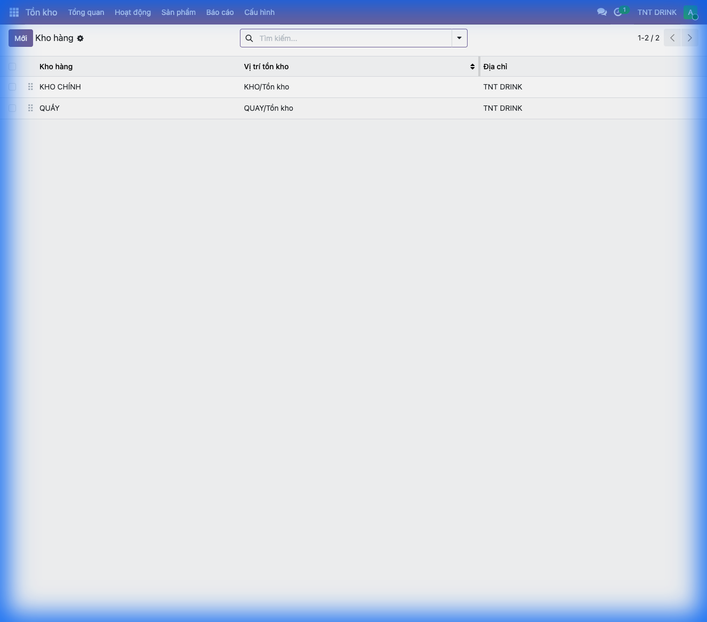
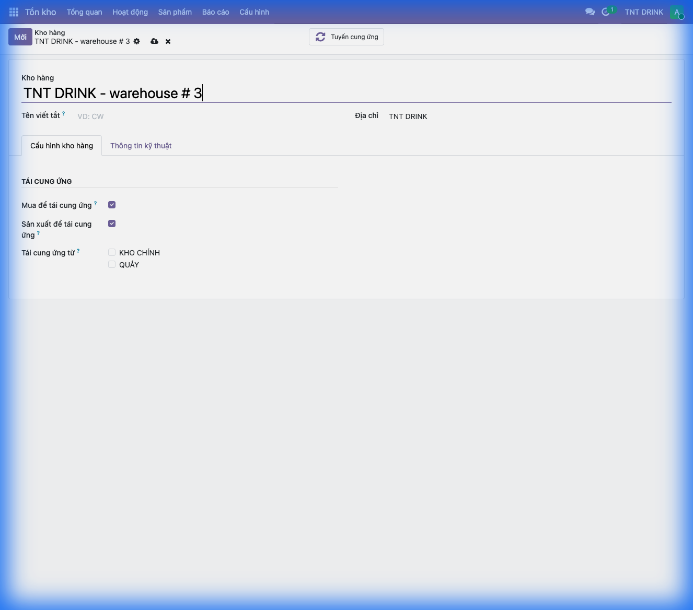

# Hướng Dẫn Tạo Kho Lưu Trữ Trong Odoo 19

## Mục Lục
1. [Giới thiệu](#1-giới-thiệu)
2. [Mô hình 2 kho cho F&B](#2-mô-hình-2-kho-cho-fb)
3. [Tạo kho mới](#3-tạo-kho-mới)
4. [Quy trình vận hành](#4-quy-trình-vận-hành)
5. [FAQ](#5-faq)

---

## 1. Giới thiệu

### Kho hàng là gì?

**Kho hàng (Warehouse)** trong Odoo là nơi lưu trữ và quản lý sản phẩm/nguyên liệu. Mỗi kho có:
- Vị trí tồn kho riêng
- Quy tắc nhập/xuất riêng
- Đơn vị tính quản lý riêng

**Đối tượng sử dụng:**
- Quản lý kho
- Chủ cửa hàng
- Nhân viên vận hành

---

## 2. Mô hình 2 kho cho F&B

### Tại sao cần chia 2 kho?

Trong vận hành F&B, việc chia thành 2 kho giúp:
- ✅ **Kiểm kê dễ dàng** theo đơn vị phù hợp
- ✅ **Kiểm soát hao hụt** chính xác hơn
- ✅ **Quản lý luân chuyển** hàng rõ ràng
- ✅ **Báo cáo tồn kho** riêng biệt

### Cấu trúc 2 kho

```
┌─────────────────────────────────────────────────────────────────┐
│                        MÔ HÌNH 2 KHO F&B                        │
├─────────────────────────────────────────────────────────────────┤
│                                                                 │
│   ┌─────────────────┐         ┌─────────────────┐              │
│   │   KHO CHÍNH     │ ──────► │   KHO QUẦY      │              │
│   │   (Lưu trữ)     │ Chuyển  │   (Sử dụng)     │              │
│   └─────────────────┘   kho   └─────────────────┘              │
│                                                                 │
│   • Hộp, Thùng, Kg         • gram, ml, cái                     │
│   • Hàng nguyên             • Hàng đang dùng                    │
│   • Kiểm kê theo Thùng/Hộp  • Kiểm kê theo gram                 │
│                                                                 │
└─────────────────────────────────────────────────────────────────┘
```

### So sánh 2 kho

| Tiêu chí | KHO CHÍNH | KHO QUẦY |
|----------|-----------|----------|
| **Mục đích** | Lưu trữ hàng nguyên | Lưu trữ hàng đang sử dụng |
| **Đơn vị tính** | Thùng, Hộp, Kg, Bao | gram, ml, cái |
| **Ví dụ** | Thùng sữa 12 hộp, Bao cà phê 25kg | 500g bột cà phê, 200ml sữa |
| **Kiểm kê** | Đếm theo đơn vị lớn | Cân/đo theo đơn vị nhỏ |
| **Tần suất kiểm** | Hàng tuần/tháng | Hàng ngày |

### Ví dụ thực tế

**Sản phẩm: Cà phê hạt**

| Kho | Đơn vị | Số lượng | Giải thích |
|-----|--------|----------|------------|
| **KHO CHÍNH** | Bao 25kg | 10 bao | 10 bao × 25kg = 250kg chưa mở |
| **KHO QUẦY** | gram | 5.000g | 5kg đang sử dụng tại quầy |

**Lợi ích:**
- 📦 Kiểm kho CHÍNH: Đếm **10 bao** (nhanh, chính xác)
- ⚖️ Kiểm kho QUẦY: Cân **5.000g** (dễ phát hiện hao hụt)

> 💡 **Mẹo**: Không nên cân 250kg + 5kg rồi cộng lại, vì khác đơn vị và khó kiểm soát.

---

## 3. Tạo kho mới

**Đường dẫn:** `Tồn kho` → `Cấu hình` → `Kho hàng`

### 3.1 Danh sách kho



Hệ thống đã có sẵn 2 kho:
- **KHO CHÍNH**: Vị trí `KHO/Tồn kho`
- **QUẦY**: Vị trí `QUAY/Tồn kho`

### 3.2 Tạo kho mới

Nhấn **"Mới"** để tạo kho.



#### Các bước thực hiện:

**Bước 1: Nhập tên kho**
- **"Kho hàng"**: Nhập tên kho
  - VD: "KHO CHÍNH" hoặc "QUẦY"

**Bước 2: Nhập mã viết tắt**
- **"Tên viết tắt"**: Mã ngắn (2-5 ký tự)
  - VD: "KHO" hoặc "QUAY"
- Mã này dùng để tạo tiền tố cho các vị trí con

**Bước 3: Chọn địa chỉ**
- **"Địa chỉ"**: Công ty/cửa hàng sở hữu kho
  - VD: "TNT DRINK"

**Bước 4: Cấu hình tái cung ứng** (Tùy chọn)
- **"Mua để tái cung ứng"**: Cho phép mua hàng vào kho này
- **"Sản xuất để tái cung ứng"**: Cho phép sản xuất vào kho này
- **"Tái cung ứng từ"**: Chọn kho nguồn để chuyển hàng đến
  - VD: Kho QUẦY có thể chọn tái cung ứng từ KHO CHÍNH

**Bước 5: Lưu**
- Nhấn **💾 Lưu** hoặc `Ctrl + S`

---

## 4. Quy trình vận hành

### 4.1 Luồng hàng hóa

```
   NHẬP HÀNG          CHUYỂN KHO          SỬ DỤNG/BÁN
       │                  │                   │
       ▼                  ▼                   ▼
┌─────────────┐    ┌─────────────┐    ┌─────────────┐
│  NHÀ CUNG   │───►│  KHO CHÍNH  │───►│  KHO QUẦY   │───► Bán hàng
│    CẤP      │    │  (Thùng,Kg) │    │   (gram)    │
└─────────────┘    └─────────────┘    └─────────────┘
                          │                   │
                          ▼                   ▼
                     Kiểm kê            Kiểm kê
                    theo Thùng         theo gram
```

### 4.2 Các thao tác hàng ngày

| Thao tác | Kho nguồn | Kho đích | Đơn vị |
|----------|-----------|----------|--------|
| Nhập hàng từ NCC | - | KHO CHÍNH | Thùng, Bao, Kg |
| Chuyển ra quầy | KHO CHÍNH | QUẦY | Hộp → gram |
| Bán hàng POS | QUẦY | - | gram (theo BoM) |
| Kiểm kê chính | KHO CHÍNH | - | Thùng, Bao |
| Kiểm kê quầy | QUẦY | - | gram |

### 4.3 Ví dụ chuyển kho

**Tình huống:** Chuyển 1 bao cà phê 25kg từ KHO CHÍNH ra QUẦY

| Bước | Thao tác | Kết quả |
|------|----------|---------|
| 1 | Tạo phiếu chuyển kho | KHO CHÍNH → QUẦY |
| 2 | Chọn "Cà phê hạt" - 1 Bao (25kg) | |
| 3 | Xác nhận chuyển | KHO CHÍNH: -25.000g |
| | | QUẦY: +25.000g |

> ⚠️ **Lưu ý**: Hệ thống tự động chuyển đổi đơn vị (Bao → gram) nếu đã cấu hình đúng trong sản phẩm.

---

## 5. Thiết lập đơn vị tính cho 2 kho

### 5.1 Cấu hình sản phẩm

Để 2 kho hoạt động với đơn vị khác nhau, cần cấu hình:

| Trường | Giá trị | Ý nghĩa |
|--------|---------|---------|
| **Đơn vị tính** | gram | Đơn vị bán/sử dụng (QUẦY) |
| **Đơn vị mua** | Bao 25kg | Đơn vị mua từ NCC (KHO CHÍNH) |

### 5.2 Ví dụ cấu hình

**Sản phẩm: Bột cà phê**

```
Đơn vị tính:    gram (cho QUẦY)
Đơn vị mua:     Bao 25kg (cho KHO CHÍNH)
Tỷ lệ:          1 Bao = 25.000 gram
```

Khi nhập hàng 2 Bao → Hệ thống tự động tính:
- KHO CHÍNH: +2 Bao (hoặc +50.000g)
- Khi xem theo gram: 50.000g

---

## 6. FAQ

### Q: Có bắt buộc phải tạo 2 kho không?
**A:** Không bắt buộc, nhưng **khuyến khích** cho F&B để quản lý dễ hơn. Nếu chỉ có 1 kho, việc kiểm kê sẽ khó khăn khi trộn lẫn đơn vị lớn (Thùng) và nhỏ (gram).

### Q: Hàng ở QUẦY hết thì làm sao?
**A:** Tạo **phiếu chuyển kho** từ KHO CHÍNH → QUẦY. Hoặc nếu đã cấu hình "Tái cung ứng", hệ thống sẽ tự động đề xuất.

### Q: Kiểm kê như thế nào với 2 kho?
**A:** 
- **KHO CHÍNH**: Kiểm kê theo đơn vị lớn (đếm Thùng, Bao)
- **QUẦY**: Kiểm kê theo đơn vị nhỏ (cân gram, đo ml)

### Q: Công thức (BoM) trừ từ kho nào?
**A:** BoM thường trừ từ **QUẦY** vì đó là nơi sản phẩm đang được sử dụng để pha chế.

### Q: Có thể có nhiều hơn 2 kho không?
**A:** Có. Ví dụ:
- KHO CHÍNH
- QUẦY 1 (Chi nhánh 1)
- QUẦY 2 (Chi nhánh 2)

---

*Tài liệu được tạo cho Odoo 19 - TRCF*
