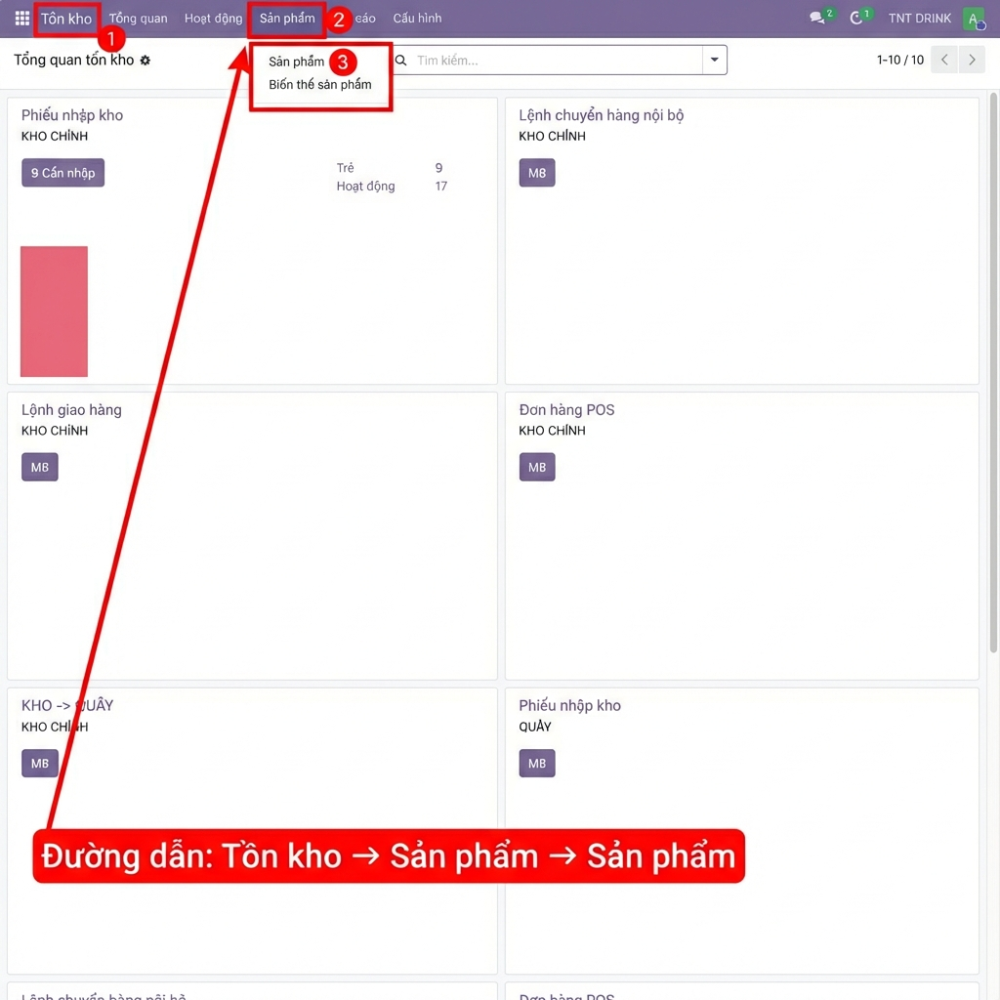
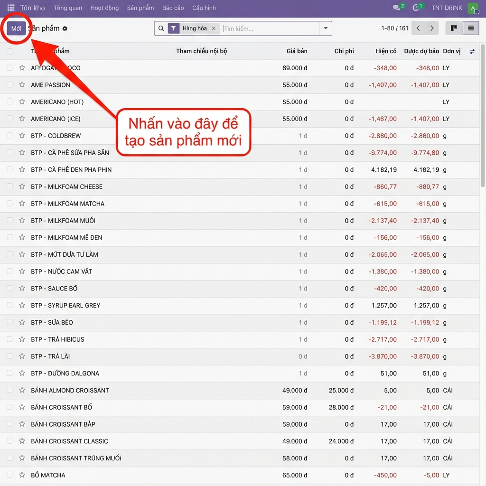
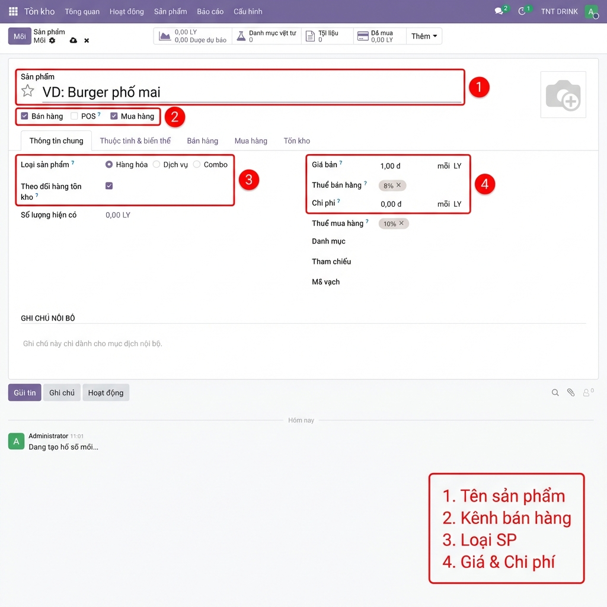
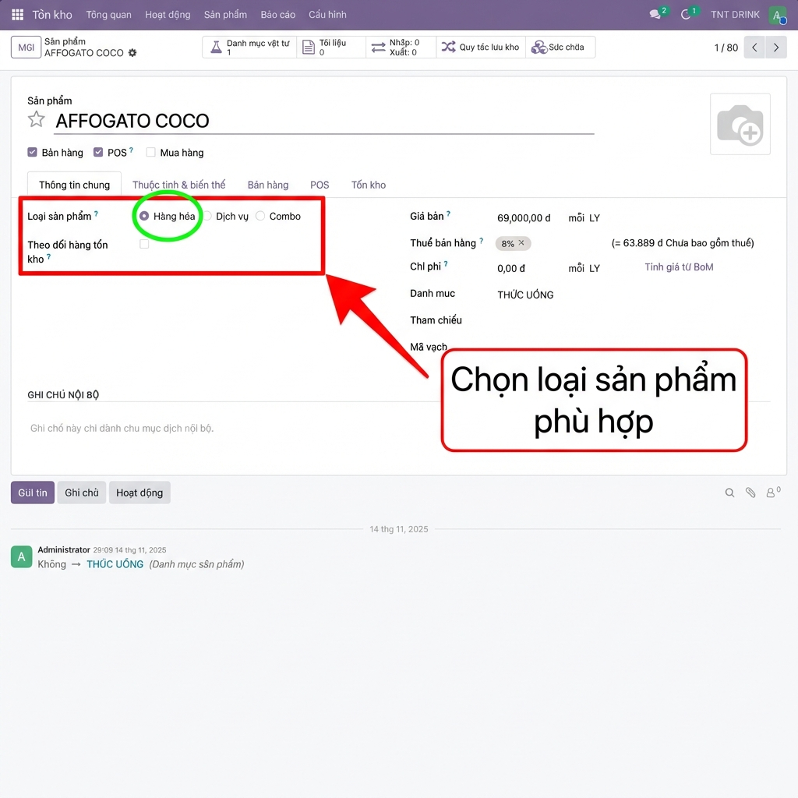
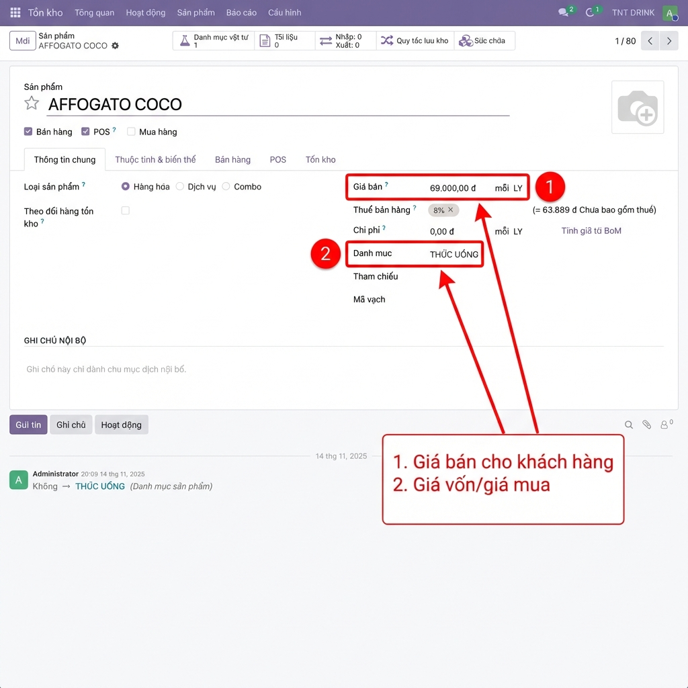
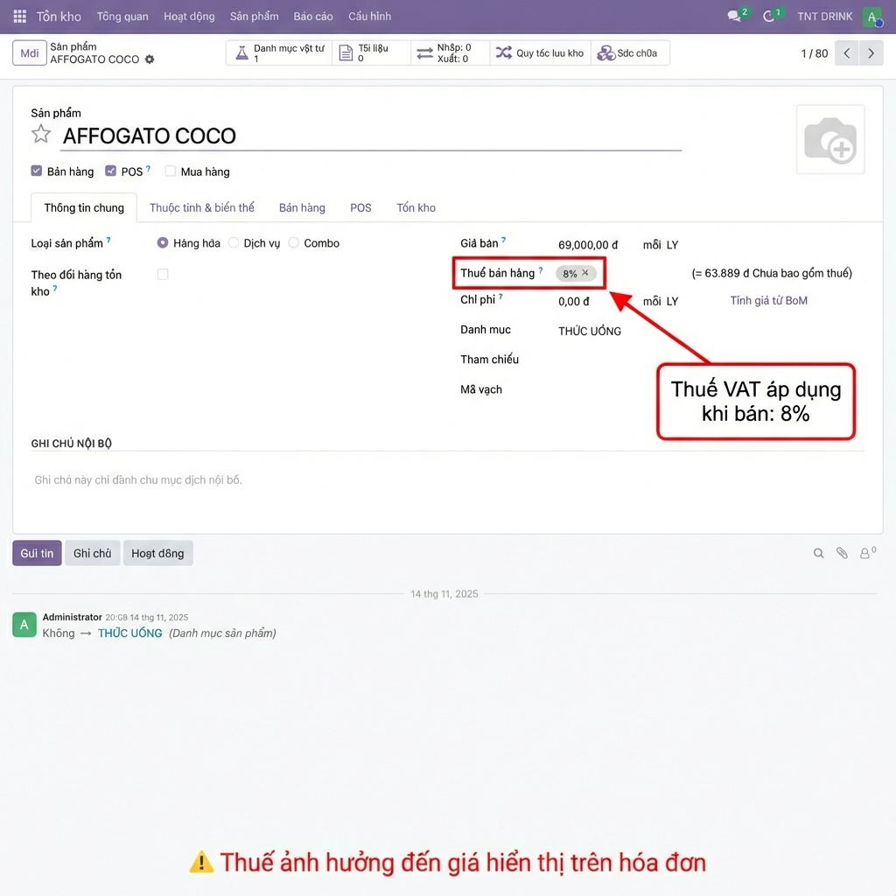
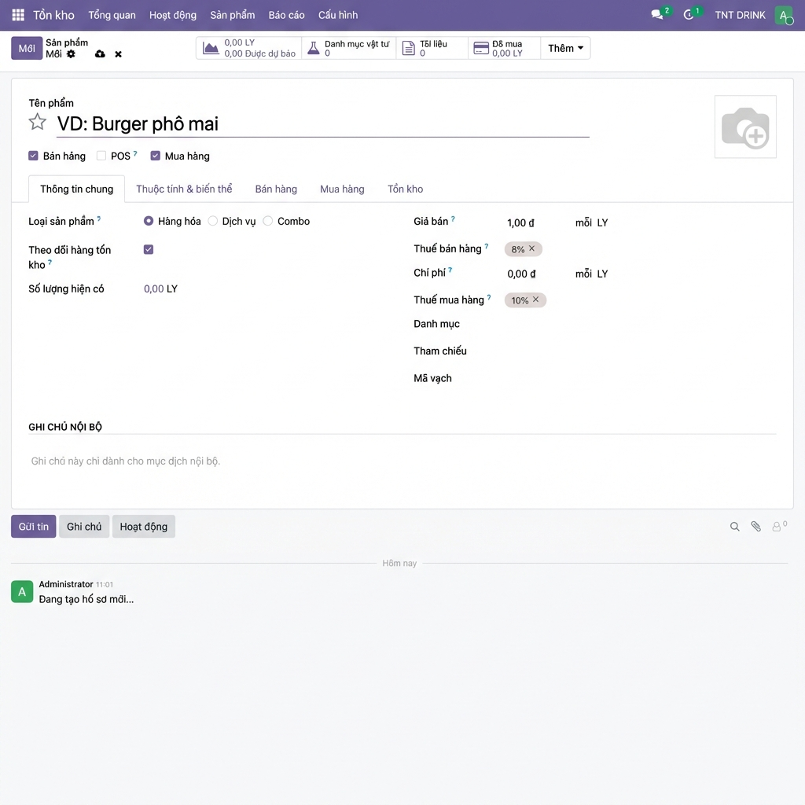
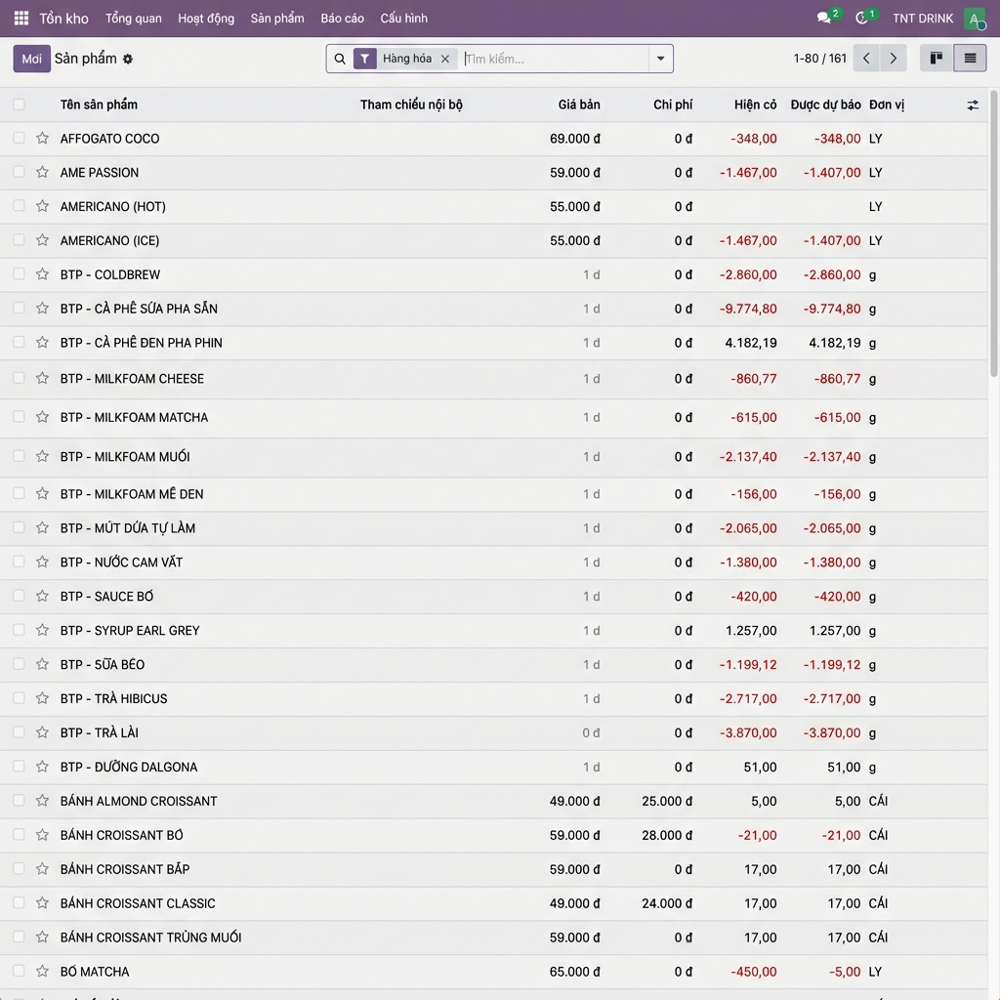
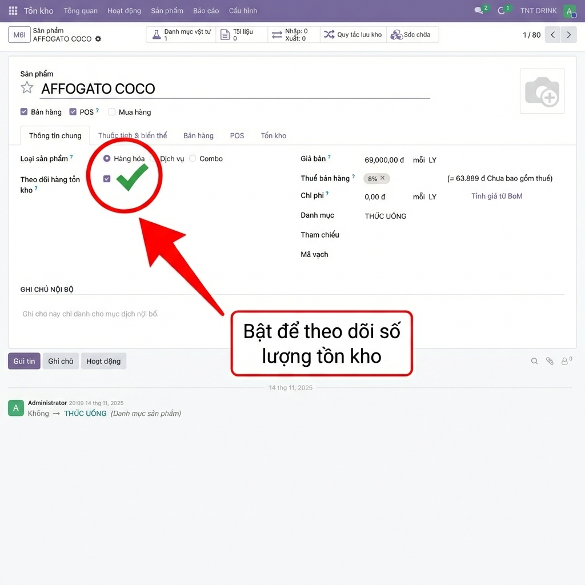
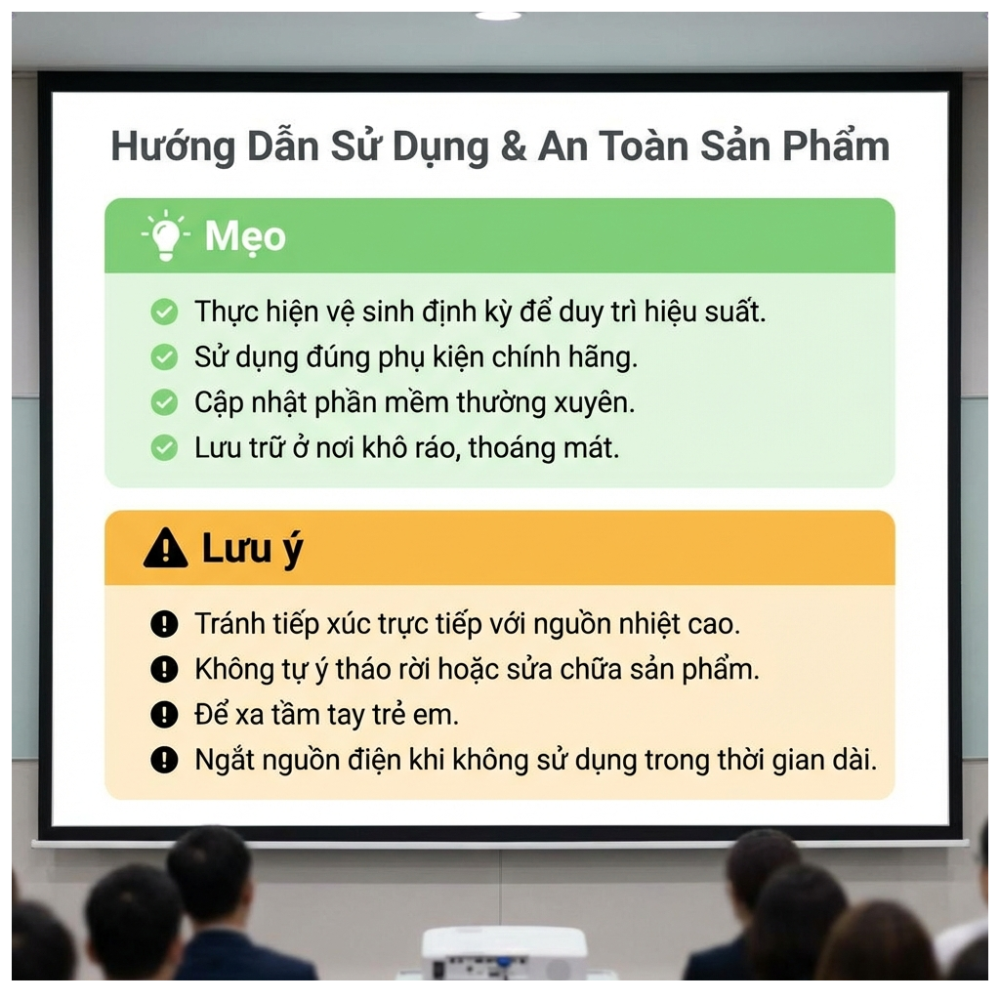

# Hướng Dẫn Thêm Sản Phẩm - Training Slides

> **Đối tượng:** Quản lý cửa hàng, Nhân viên kho, Nhân viên bán hàng  
> **Thời lượng:** ~10-15 phút  
> **Module:** TRCF POS - Tồn kho / Sản phẩm  
> **Phiên bản:** Screenshots thật từ hệ thống

---

## Slide 1: Giới thiệu

**Nội dung chính:**
- Mục đích: Hướng dẫn tạo sản phẩm mới trong TRCF POS
- Đối tượng: Quản lý cửa hàng, Nhân viên kho, Nhân viên bán hàng

**Script:**
> "Chào mừng các bạn đến với buổi hướng dẫn về cách thêm sản phẩm trong TRCF POS.
> Hôm nay chúng ta sẽ học cách tạo sản phẩm mới với đầy đủ thông tin cần thiết.
> Hãy cùng bắt đầu."

---

## Slide 2: Truy cập danh sách sản phẩm

**Nội dung chính:**
- **Bước 1**: Vào module **Tồn kho**
- **Bước 2**: Click menu **Sản phẩm** trên thanh navigation
- **Bước 3**: Chọn **Sản phẩm** trong dropdown

**Script:**
> "Để truy cập danh sách sản phẩm, các bạn thực hiện 3 bước như trong hình.
> Đầu tiên, vào module Tồn kho từ menu chính.
> Sau đó click vào Sản phẩm trên thanh menu, rồi chọn Sản phẩm trong danh sách hiện ra."

---

## Slide 3: Nhấn nút "Mới"

**Nội dung chính:**
- Vị trí: Góc trên bên trái màn hình
- Hành động: Nhấn nút **"Mới"** màu xanh để tạo sản phẩm mới

**Script:**
> "Tại màn hình danh sách sản phẩm, các bạn hãy nhìn vào góc trên bên trái.
> Nút Mới màu xanh được khoanh đỏ trong hình chính là nút để tạo sản phẩm mới.
> Hãy nhấn vào đó để mở form tạo sản phẩm."

---

## Slide 4: Tổng quan Form sản phẩm

**Nội dung chính:**
| # | Vùng | Mô tả |
|---|------|-------|
| 1 | Tên sản phẩm | Nhập tên rõ ràng, dễ nhận biết |
| 2 | Kênh bán hàng | Bán hàng, POS, Mua hàng |
| 3 | Loại sản phẩm | Hàng hóa / Dịch vụ / Combo |
| 4 | Giá & Chi phí | Giá bán và giá vốn |

**Script:**
> "Đây là tổng quan form tạo sản phẩm với 4 vùng thông tin chính.
> Vùng 1 là tên sản phẩm. Vùng 2 là các kênh bán hàng.
> Vùng 3 là loại sản phẩm. Vùng 4 là giá bán và chi phí.
> Chúng ta sẽ đi chi tiết từng vùng ở các slide tiếp theo."

---

## Slide 5: Chọn loại sản phẩm

**Nội dung chính:**
| Loại | Ý nghĩa | Sử dụng khi |
|------|---------|-------------|
| **Hàng hóa** ✅ | Theo dõi tồn kho | Nguyên liệu, thành phẩm |
| **Dịch vụ** | Không theo dõi tồn kho | Phí ship, dịch vụ |
| **Combo** | Kết hợp nhiều sản phẩm | Combo bữa ăn |

**Script:**
> "Trường Loại sản phẩm rất quan trọng.
> Chọn Hàng hóa nếu cần theo dõi số lượng tồn kho như nguyên liệu, thành phẩm.
> Chọn Dịch vụ cho các dịch vụ không lưu kho như phí ship.
> Combo dùng cho sản phẩm kết hợp nhiều món."

---

## Slide 6: Nhập giá bán & Chi phí

**Nội dung chính:**
| # | Trường | Ý nghĩa | Ví dụ |
|---|--------|---------|-------|
| 1 | **Giá bán** | Giá khách hàng trả | 69,000 đ |
| 2 | **Chi phí** | Giá vốn / Giá mua | 25,000 đ |

**Script:**
> "Hai trường giá quan trọng cần điền là Giá bán và Chi phí.
> Giá bán là giá khách hàng sẽ thanh toán khi mua sản phẩm.
> Chi phí là giá vốn hoặc giá bạn mua từ nhà cung cấp.
> Hệ thống sẽ dùng 2 giá này để tính lợi nhuận trong báo cáo."

---

## Slide 7: Cấu hình thuế

**Nội dung chính:**
- **Thuế bán hàng**: VAT áp dụng khi bán cho khách (8%, 10%, 0%)
- ⚠️ Thuế ảnh hưởng đến giá hiển thị trên hóa đơn

**Script:**
> "Phần cấu hình thuế rất quan trọng với hóa đơn.
> Thuế bán hàng là VAT sẽ tính khi xuất hóa đơn cho khách.
> Ví dụ sản phẩm này đang áp dụng 8% VAT.
> Lưu ý: Cấu hình này ảnh hưởng đến cách tính giá và thuế trên hóa đơn."

---

## Slide 8: Thêm hình ảnh sản phẩm

**Nội dung chính:**
- **Vị trí**: Góc trên bên phải form sản phẩm (vùng camera icon)
- **Định dạng hỗ trợ**: PNG, JPG, WEBP
- **Kích thước khuyến nghị**: 500x500 pixel, tỷ lệ 1:1 (vuông)

**Script:**
> "Để thêm hình ảnh sản phẩm, nhìn vào góc trên bên phải của form.
> Click vào vùng hình camera để upload ảnh từ máy tính.
> Nên dùng ảnh vuông, kích thước từ 500x500 pixel để hiển thị đẹp trên POS và website."

---

## Slide 9: Lưu sản phẩm

**Nội dung chính:**
- **Cách 1**: Nhấn nút **"Lưu"** trên thanh toolbar (hoặc tự động lưu)
- **Cách 2**: Nhấn tổ hợp phím `Ctrl + S`
- Sản phẩm mới sẽ xuất hiện trong danh sách

**Script:**
> "Sau khi điền đầy đủ thông tin, hệ thống thường tự động lưu.
> Nếu cần lưu thủ công, bạn có thể nhấn Ctrl + S.
> Sản phẩm đã tạo sẽ xuất hiện trong danh sách như hình."

---

## Slide 10: Theo dõi hàng tồn kho

**Nội dung chính:**
- **Checkbox**: "Theo dõi hàng tồn kho" trong tab Thông tin chung
- **Khi bật** ✅: Hiển thị số lượng "Hiện có", cập nhật khi xuất/nhập kho
- **Khi tắt** ❌: Không theo dõi số lượng, luôn coi như có sẵn

**Script:**
> "Một cài đặt quan trọng là checkbox Theo dõi hàng tồn kho.
> Bật checkbox này nếu bạn muốn hệ thống theo dõi số lượng tồn.
> Khi bật, bạn sẽ thấy số lượng hiện có và hệ thống tự động cập nhật khi xuất nhập kho.
> Nên bật cho hàng hóa, tắt cho dịch vụ."

---

## Slide 11: Lưu ý quan trọng

**Nội dung chính:**

> 💡 **Mẹo:**
> - Đặt tên sản phẩm rõ ràng, dễ tìm kiếm
> - Dùng ảnh vuông 1:1 để hiển thị đẹp trên POS
> - Có thể đặt đơn vị mua khác đơn vị bán (mua Thùng, bán Lon)

> ⚠️ **Lưu ý:**
> - Sau khi có giao dịch kho, không nên tắt "Theo dõi hàng tồn kho"
> - Kiểm tra cấu hình thuế ảnh hưởng đến cách hiển thị giá
> - Tick đúng kênh bán hàng để sản phẩm hiển thị đúng nơi

**Script:**
> "Trước khi kết thúc, có một số lưu ý quan trọng.
> Đầu tiên, đặt tên sản phẩm rõ ràng để dễ tìm kiếm.
> Thứ hai, sau khi đã có giao dịch kho, không nên tắt theo dõi tồn kho.
> Và cuối cùng, nhớ tick đúng kênh bán hàng để sản phẩm hiển thị đúng nơi cần."

---

## Slide 12: Tổng kết

**Nội dung chính:**

✅ **Đã học:**
1. Truy cập danh sách sản phẩm (Tồn kho → Sản phẩm → Sản phẩm)
2. Tạo sản phẩm mới với đầy đủ thông tin
3. Nhập giá bán & chi phí
4. Cấu hình thuế VAT
5. Upload hình ảnh sản phẩm
6. Bật theo dõi hàng tồn kho

📌 **Bước tiếp theo:** Thực hành ngay trên hệ thống!

**Script:**
> "Vậy là chúng ta đã hoàn thành buổi hướng dẫn.
> Các bạn đã biết cách truy cập và tạo sản phẩm mới với đầy đủ thông tin.
> Từ tên sản phẩm, giá bán, chi phí, thuế, cho đến hình ảnh và theo dõi tồn kho.
> Hãy thử thực hành ngay trên hệ thống hôm nay. Cảm ơn các bạn đã theo dõi!"

---

*Slides được tạo cho TRCF POS - Training*  
*Sử dụng screenshots thật từ hệ thống với annotations chuyên nghiệp*
